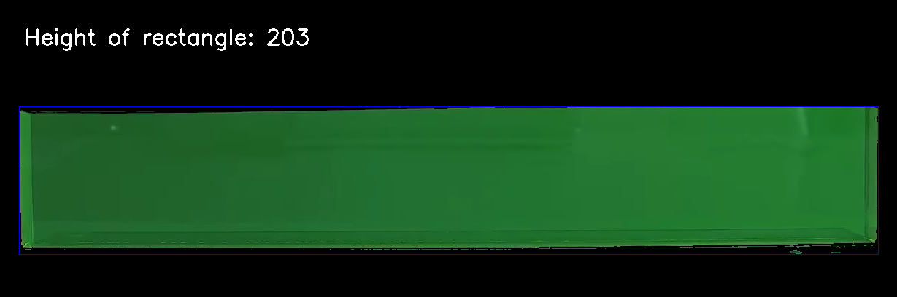
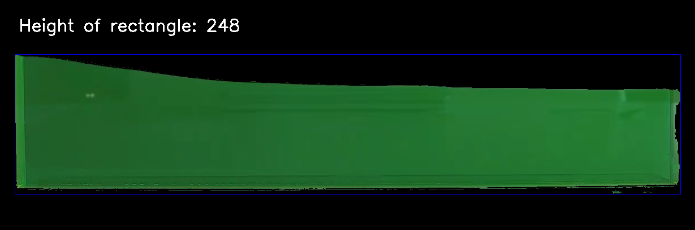
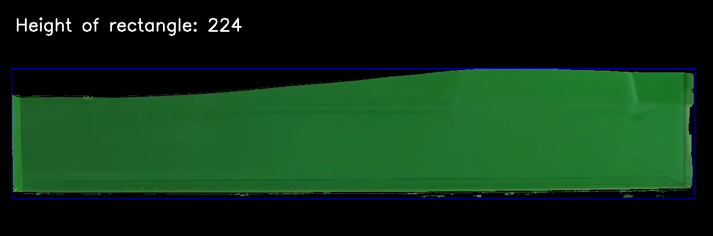

# Wave Height

A simple project in Python that uses OpenCV to detect the height of waves in a tank of green dyed water.

The color range threshold values can be adjusted (in the HSV color space) to detect other
colors as well as removing unwanted shades.

Examples:

